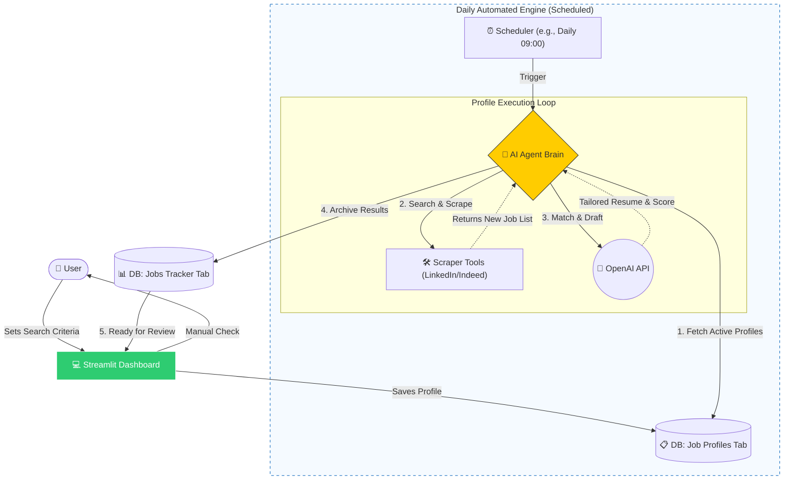
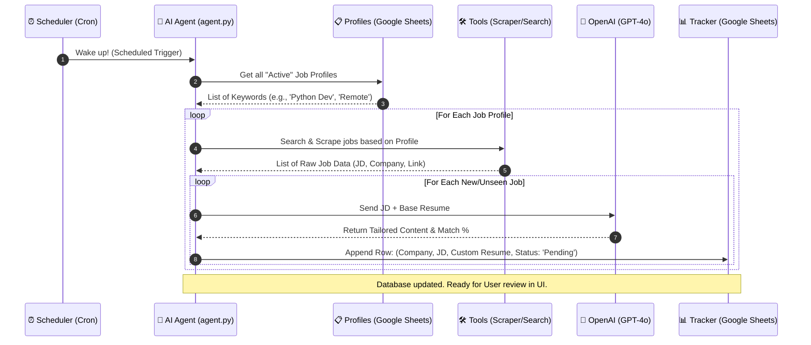

# Good Will Hunt: AI Job Hunter App

## 🚀 Project Overview
**Good Will Hunt** is a lightweight, agentic Web App designed to automate the most tedious parts of the job application process: scraping job descriptions (JD), analyzing fit, and generating tailored resumes. 

Unlike a rigid automation pipeline, this system uses an **AI Agent** that can autonomously decide which tools to use based on the task at hand.

---

## 🛠️ Tech Stack
* **Language:** Python 3.10+
* **Frontend:** [Streamlit](https://streamlit.io/) (For a zero-config Web UI)
* **Agent Framework:** [LangChain](https://www.langchain.com/) (ReAct logic)
* **Brain:** OpenAI GPT-4o / GPT-4o-mini
* **Database:** Google Sheets (via `gspread` API)
* **Tools:** Playwright (Scraping), Tavily/Google (Search)

---

## 1. System Architecture (Flowchart)
The following diagram illustrates the high-level logic and how the Agent interacts with various tools during the "Thinking" loop.

## 2. Sequence Diagram

## 3. Data Schema (Google Sheets)
The "Database" is a Google Sheet with the following columns:

<table border="1" style="width:100%; border-collapse: collapse; text-align: left;">
<thead>
<tr style="background-color: #f2f2f2;">
<th style="padding: 10px;">Column</th>
<th style="padding: 10px;">Description</th>
</tr>
</thead>
<tbody>
<tr>
<td style="padding: 10px;"><strong>Date</strong></td>
<td style="padding: 10px;">Timestamp of the analysis (e.g., <code>2026-02-27 21:00</code>)</td>
</tr>
<tr>
<td style="padding: 10px;"><strong>Company</strong></td>
<td style="padding: 10px;">Extracted name of the hiring organization</td>
</tr>
<tr>
<td style="padding: 10px;"><strong>Position</strong></td>
<td style="padding: 10px;">Official job title extracted from the Job Description (JD)</td>
</tr>
<tr>
<td style="padding: 10px;"><strong>Match Score</strong></td>
<td style="padding: 10px;">AI's assessment of your fit for the role (0-100)</td>
</tr>
<tr>
<td style="padding: 10px;"><strong>Resume URL</strong></td>
<td style="padding: 10px;">The link to the tailored Google Doc/PDF created for this specific application</td>
</tr>
<tr>
<td style="padding: 10px;"><strong>Status</strong></td>
<td style="padding: 10px;">Current workflow stage (e.g., <code>Pending</code>, <code>Applied</code>, <code>Interview</code>, <code>Rejected</code>)</td>
</tr>
</tbody>
</table>

## 4. Key Implementation Details
Human-in-the-Loop: The system doesn't "blindly" apply. It generates the materials and logs them, allowing the user to perform a final 1-minute quality check.

Modular Tools: Every external capability (Google Sheets, Scraping, Search) is isolated in tools.py as a decorated function, making it easy to swap or update.

Stateless Deployment: Since all data is stored in Google Sheets and secrets are managed via Streamlit Cloud, the app can be redeployed anywhere without data loss.