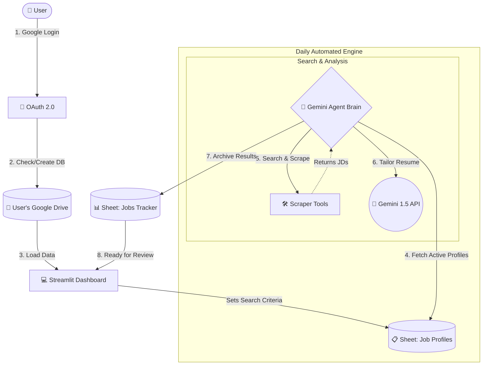
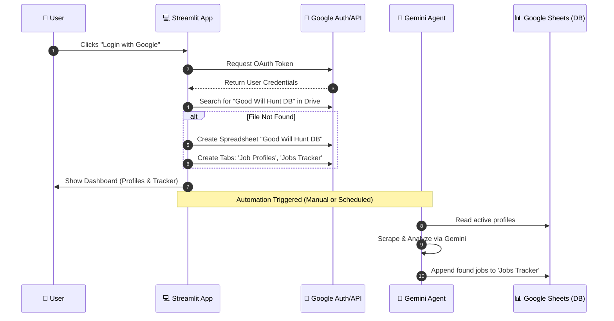

# Good Will Hunt: AI Job Hunter App

## 🚀 Project Overview
**Good Will Hunt** is a lightweight, agentic Web App designed to automate the most tedious parts of the job application process: scraping job descriptions (JD), analyzing fit, and generating tailored resumes. 

The system uses a **Google Gemini-powered Agent** that integrates directly with the user's Google account for storage (Sheets) and document generation (Docs).

---

## 🛠️ Tech Stack
* **Language:** Python 3.10+
* **Frontend:** [Streamlit](https://streamlit.io/)
* **Auth:** Google OAuth 2.0 (User-centric data ownership)
* **Agent Framework:** [LangChain](https://www.langchain.com/)
* **Brain:** Google Gemini 1.5 Pro / Flash
* **Database:** Google Sheets (Created automatically in User's Drive)
* **Tools:** Playwright (Scraping), Tavily/Google (Search)

---

## 1. System Architecture (Flowchart)

## 2. Sequence Diagram (Initial Setup & Loop)

## 3. Data Schema (Google Sheets)
The database is a Google Sheet created in the **user's own account**.

### Tab: Job Profiles
| Column | Description |
| :--- | :--- |
| **Profile ID** | Unique ID |
| **Title** | Target Job Title (e.g. AI Engineer) |
| **Location** | Remote, Hybrid, etc. |
| **Keywords** | Key tech stack |
| **Status** | Active / Paused |

### Tab: Jobs Tracker
| Column | Description |
| :--- | :--- |
| **Date** | Timestamp |
| **Company** | Hiring Org |
| **Position** | Extracted Title |
| **Match Score** | Gemini's assessment (0-100) |
| **Resume URL** | Link to tailored Doc |
| **Status** | Pending, Applied, Interview, etc. |